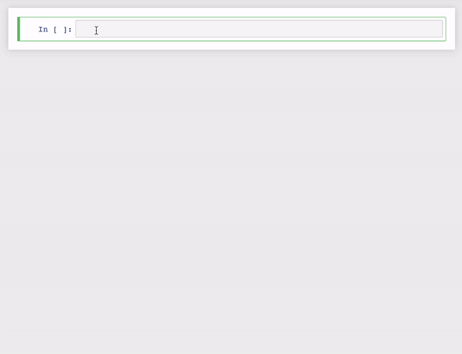

<p align="center"></p>

<h3 align="center">
<p> Therapeutics Data Commons: A Benchmark for Medicinal Machine Learning
</h3>

---

This repository hosts Therapeutics Data Commons (TDC), an open, user-friendly and extensive dataset benchmark for medicinal machine learning tasks. So far, it includes more than 100+ datasets for 20+ tasks (ranging from target identification, virtual screening, QSAR to patient recruitment, safety survellience and etc) in most of the drug development stages (from discovery and development to clinical trials and post-market monitoring). 

## Features

- Extensive: covers 100+ datasets for 20+ tasks in most of the drug development stages.
- Ready-to-use: the output can directly feed into prediction library such as scikit-learn and DeepPurpose. 
- User-friendly: very easy to load the dataset (3 lines of codes) and supports various useful functions such as conversion to DGL/PyG graph for interaction data, cold/scaffold split, label distribution visualization, binarize, log-conversion and so much more! 
- Benchmark: provides a benchmark mode for fair comparison. We also provide a leaderboard!
- Easy-to-contribute: provides a very simple way to contribute a new dataset (just write a loading function, see [CONTRIBUTE](CONTRIBUTE.md) page)!

## Example



<details>
<summary>CLICK HERE FOR THE CODE!</summary>

```python
from DrugDataLoader import ADMET
data = ADMET.DataLoader(name = 'LogD74')
# scaffold split using benchmark seed
split = data.get_split(method = 'scaffold', seed = 'benchmark')
# visualize label distribution
data.label_distribution()
# binarize 
data.binarize()
# convert to log
data.conver_to_log()
# get data in the various formats
data.get_data(format = 'DeepPurpose')
```
</details>


## Installation

```bash
pip install tdc
```

## Cite

```
arxiv placeholder
```

## Core Data Overview
We have X task formulations and each is associated with many datasets. For example, ADMET is a task formulation and it has its own many datasets. To call a dataset Y from task formulation X, simply calling ```X(name = Y)```.

### Property Prediction

* <b>Absorption, Distribution, Metabolism, Excretion and Toxicity</b>```ADME```
	<details>
  	<summary>CLICK HERE FOR THE DATASETS!</summary>

  	* <h3>Lipophilicity</h3>

  	 Dataset Name  | Description| Reference | Type | Stats
	 ------------  | ------------------------ | ----------- | ----------- | -----------
	 AstraZeneca <br> `ADMET.DataLoader(name = 'Lipo_AZ')`</br>  | Lipophilicity is a dataset curated from ChEMBL database containing experimental results on octanol/water distribution coefficient (logD at pH=7.4). From MoleculeNet.| [AstraZeneca. Experimental in vitro Dmpk and physicochemical data on a set of publicly disclosed compounds (2016) ](https://doi.org/10.6019/chembl3301361) | Regression | 4,200 Drugs
	 LogD74 <br> `ADMET.DataLoader(name = 'LogD74')` </br>| A high-quality hand-curated lipophilicity dataset that includes the chemical structure of 1,130 organic compounds and their n-octanol/buffer solution distribution coefficients at pH 7.4 (logD7.4). | [Wang, J-B., D-S. Cao, M-F. Zhu, Y-H. Yun, N. Xiao, Y-Z. Liang (2015). In silico evaluation of logD7.4 and comparison with other prediction methods. Journal of Chemometrics, 29(7), 389-398.](https://onlinelibrary.wiley.com/doi/full/10.1002/cem.2718) | Regression | 1,094 Drugs
	
	* <h3>Solubility</h3>

  	 Dataset Name  | Description| Reference | Type | Stats
	 ------------  | ------------------------ | ----------- | ----------- | -----------
	 AqSolDB <br> `ADMET.DataLoader(name = 'AqSolDB') ` </br>| AqSolDB: A curated reference set of aqueous solubility, created by the Autonomous Energy Materials Discovery [AMD] research group, consists of aqueous solubility values of 9,982 unique compounds curated from 9 different publicly available aqueous solubility datasets. | [Sorkun, M.C., Khetan, A. & Er, S. AqSolDB, a curated reference set of aqueous solubility and 2D descriptors for a diverse set of compounds. Sci Data 6, 143 (2019).](https://doi.org/10.1038/s41597-019-0151-1) | Regression | 9,982 Drugs
	 ESOL <br> `ADMET.DataLoader(name = 'ESOL')` </br>| ESOL (delaney) is a standard regression dataset containing structures and water solubility data for 1128 compounds. From MoleculeNet. | [Delaney, John S. "ESOL: estimating aqueous solubility directly from molecular structure." Journal of chemical information and computer sciences 44.3 (2004): 1000-1005.](https://pubs.acs.org/doi/abs/10.1021/ci034243x) | Regression | 1,128 Drugs
	 FreeSolv <br> `ADMET.DataLoader(name = 'FreeSolv')` </br>| The Free Solvation Database, FreeSolv(SAMPL), provides experimental and calculated hydration free energy of small molecules in water. The calculated values are derived from alchemical free energy calculations using molecular dynamics simulations. From MoleculeNet.| [Mobley, David L., and J. Peter Guthrie. "FreeSolv: a database of experimental and calculated hydration free energies, with input files." Journal of computer-aided molecular design 28.7 (2014): 711-720.](https://pubmed.ncbi.nlm.nih.gov/24928188/) | Regression | 642 Drugs

	* <h3>Absorption</h3>

  	 Dataset Name  | Description| Reference | Type | Stats
	 ------------  | ------------------------ | ----------- | ----------- | -----------
	 Caco-2	<br> `ADMET.DataLoader(name = 'Caco2')` </br> | The Caco-2 cell effective permeability (Peff) is an in vitro approximation of the rate at which the drug passes through intestinal tissue. | [Ning-Ning Wang, Jie Dong, Yin-Hua Deng, Min-Feng Zhu, Ming Wen, Zhi-Jiang Yao, Ai-Ping Lu, Jian-Bing Wang, and Dong-Sheng Cao. Journal of Chemical Information and Modeling 2016 56 (4), 763-773](https://pubmed.ncbi.nlm.nih.gov/27018227/) | Regression | 910 Drugs
	 HIA <br> `ADMET.DataLoader(name = 'HIA')` </br>| The human intestinal absorption (HIA) means the process of orally administered drugs are absorbed from the gastrointestinal system into the bloodstream of the human body. | [Hou T, Wang J, Zhang W, Xu X. ADME evaluation in drug discovery. 7. Prediction of oral absorption by correlation and classification. J Chem Inf Model. 2007;47(1):208-218. doi:10.1021/ci600343x](https://pubmed.ncbi.nlm.nih.gov/17238266/) | Binary | 578 Drugs
	 Pgp <br>`ADMET.DataLoader(name = 'Pgp_inhibitor')` </br>| P-glycoprotein (Pgp or ABCB1) is an ABC transporter protein involved in intestinal absorption, drug metabolism, and brain penetration, and its inhibition can seriously alter a drug's bioavailability and safety. In addition, inhibitors of Pgp can be used to overcome multidrug resistance. | [A Novel Approach for Predicting P-Glycoprotein (ABCB1) Inhibition Using Molecular Interaction Fields. Fabio Broccatelli, Emanuele Carosati, Annalisa Neri, Maria Frosini, Laura Goracci, Tudor I. Oprea, and Gabriele Cruciani. Journal of Medicinal Chemistry 2011 54 (6), 1740-1751](https://pubs.acs.org/doi/abs/10.1021/jm101421d) | Binary | 1,267 Drugs
	 Bioavailability <br> `ADMET.DataLoader(name = 'Bioavailability')` </br> | Oral bioavailability is defined as (taking the FDA's definition) “the rate and extent to which the active ingredient or active moiety is absorbed from a drug product and becomes available at the site of action”. | [Ma, Chang-Ying, et al. "Prediction models of human plasma protein binding rate and oral bioavailability derived by using GA–CG–SVM method." Journal of pharmaceutical and biomedical analysis 47.4-5 (2008): 677-682.](https://doi.org/10.1016/j.jpba.2008.03.023) | Binary | 640 Drugs
	 Bioavailability_F20_eDrug3D <br> `ADMET.DataLoader(name = 'Bioavailability_F20_eDrug3D')`</br> | Oral bioavailability is defined as (taking the FDA's definition) “the rate and extent to which the active ingredient or active moiety is absorbed from a drug product and becomes available at the site of action”. Processed from eDrug3D dataset. Using 20% as the threshold. | [Pihan E, Colliandre L, Guichou JF, Douguet D. e-Drug3D: 3D structure collections dedicated to drug repurposing and fragment-based drug design. Bioinformatics. 2012;28(11):1540-1541.](https://pubmed.ncbi.nlm.nih.gov/22539672/) | Binary | 403 Drugs
	 Bioavailability_F30_eDrug3D <br> `ADMET.DataLoader(name = 'Bioavailability_F30_eDrug3D')`</br> | Oral bioavailability is defined as (taking the FDA's definition) “the rate and extent to which the active ingredient or active moiety is absorbed from a drug product and becomes available at the site of action”. Processed from eDrug3D dataset. Using 30% as the threshold. | [Pihan E, Colliandre L, Guichou JF, Douguet D. e-Drug3D: 3D structure collections dedicated to drug repurposing and fragment-based drug design. Bioinformatics. 2012;28(11):1540-1541.](https://pubmed.ncbi.nlm.nih.gov/22539672/)| Binary | 403 Drugs

	 * <h3>Distribution</h3>

  	 Dataset Name  | Description| Reference | Type | Stats
	 ------------  | ------------------------ | ----------- | ----------- | -----------
	 BBB <br> `ADMET.DataLoader(name = 'BBB')`</br> | The blood–brain barrier (BBB) is a highly selective semipermeable border of endothelial cells that prevents solutes in the circulating blood from non-selectively crossing into the extracellular fluid of the central nervous system where neurons reside. | [Adenot M, Lahana R. Blood-brain barrier permeation models: discriminating between potential CNS and non-CNS drugs including P-glycoprotein substrates. J Chem Inf Comput Sci. 2004;44(1):239-248.](https://pubmed.ncbi.nlm.nih.gov/14741033/)
	 BBB_MolNet <br>`ADMET.DataLoader(name = 'BBB_MolNet')` </br>| The blood-brain barrier penetration (BBB) dataset is extracted from a study on the modeling and prediction of the barrier permeability. As a membrane separating circulating blood and brain extracellular fluid, the blood-brain barrier blocks most drugs, hormones and neurotransmitters. Thus penetration of the barrier forms a long-standing issue in development of drugs targeting central nervous system. This dataset includes binary labels for over 2000 compounds on their permeability properties. From MoleculeNet. | [Martins, Ines Filipa, et al. "A Bayesian approach to in silico blood-brain barrier penetration modeling." Journal of chemical information and modeling 52.6 (2012): 1686-1697.](https://pubmed.ncbi.nlm.nih.gov/22612593/)
	 PPBR <br> `ADMET.DataLoader(name = 'PPBR')` </br>| The human plasma protein binding rate (PPBR) is expressed as the percentage of a drug bound to plasma proteins. Medications attach to proteins within the blood. A drug's efficiency may be affected by the degree to which it binds. The less bound a drug is, the more efficiently it can traverse cell membranes or diffuse. | [Ma, Chang-Ying, et al. "Prediction models of human plasma protein binding rate and oral bioavailability derived by using GA–CG–SVM method." Journal of pharmaceutical and biomedical analysis 47.4-5 (2008): 677-682.](https://doi.org/10.1016/j.jpba.2008.03.023)
	 PPBR_eDrug3D <br> `ADMET.DataLoader(name = 'PPBR_eDrug3D')` </br>| The human plasma protein binding rate (PPBR) is expressed as the percentage of a drug bound to plasma proteins. Medications attach to proteins within the blood. A drug's efficiency may be affected by the degree to which it binds. The less bound a drug is, the more efficiently it can traverse cell membranes or diffuse. Processed from eDrug3D dataset.| [Pihan E, Colliandre L, Guichou JF, Douguet D. e-Drug3D: 3D structure collections dedicated to drug repurposing and fragment-based drug design. Bioinformatics. 2012;28(11):1540-1541.](https://pubmed.ncbi.nlm.nih.gov/22539672/)
	 VD_eDrug3D <br> `ADMET.DataLoader(name = 'VD_eDrug3D')` </br>| The volume of distribution is the theoretical volume that would be necessary to contain the total amount of an administered drug at the same concentration that it is observed in the blood plasma. Processed from eDrug3D dataset.| [Pihan E, Colliandre L, Guichou JF, Douguet D. e-Drug3D: 3D structure collections dedicated to drug repurposing and fragment-based drug design. Bioinformatics. 2012;28(11):1540-1541.](https://pubmed.ncbi.nlm.nih.gov/22539672/)


	 * <h3>Metabolism</h3>

  	 Dataset Name  | Description| Reference | Type | Stats
	 ------------  | ------------------------ | ----------- | ----------- | -----------
	 CYP2C19 <br> `ADMET.DataLoader(name = 'CYP2C19')`</br>  | The CYP P450 genes are involved in the formation and breakdown (metabolism) of various molecules and chemicals within cells. Specifically, the CYP P450 2C19 gene provide instructions for making an enzyme that is found primarily in liver cells in a cell structure called the endoplasmic reticulum, which is involved in protein processing and transport. | [Veith, Henrike et al. “Comprehensive characterization of cytochrome P450 isozyme selectivity across chemical libraries.” Nature biotechnology vol. 27,11 (2009): 1050-5.](https://www.ncbi.nlm.nih.gov/pmc/articles/PMC2783980/); [PubChem AID1851](https://pubchem.ncbi.nlm.nih.gov/bioassay/1851) | Binary | 12,665 Drugs
	 CYP2D6 <br> `ADMET.DataLoader(name = 'CYP2D6')`</br> | The CYP P450 genes are involved in the formation and breakdown (metabolism) of various molecules and chemicals within cells. Specifically, CYP2D6 is primarily expressed in the liver. It is also highly expressed in areas of the central nervous system, including the substantia nigra. | [Veith, Henrike et al. “Comprehensive characterization of cytochrome P450 isozyme selectivity across chemical libraries.” Nature biotechnology vol. 27,11 (2009): 1050-5.](https://www.ncbi.nlm.nih.gov/pmc/articles/PMC2783980/); [PubChem AID1851](https://pubchem.ncbi.nlm.nih.gov/bioassay/1851)| Binary | 13,130 Drugs
	 CYP3A4 <br> `ADMET.DataLoader(name = 'CYP3A4')`</br> | The CYP P450 genes are involved in the formation and breakdown (metabolism) of various molecules and chemicals within cells. Specifically, CYP3A4 is an important enzyme in the body, mainly found in the liver and in the intestine. It oxidizes small foreign organic molecules (xenobiotics), such as toxins or drugs, so that they can be removed from the body. | [Veith, Henrike et al. “Comprehensive characterization of cytochrome P450 isozyme selectivity across chemical libraries.” Nature biotechnology vol. 27,11 (2009): 1050-5.](https://www.ncbi.nlm.nih.gov/pmc/articles/PMC2783980/); [PubChem AID1851](https://pubchem.ncbi.nlm.nih.gov/bioassay/1851)| Binary | 12,328 Drugs
	 CYP1A2 <br> `ADMET.DataLoader(name = 'CYP1A2')`</br> | The CYP P450 genes are involved in the formation and breakdown (metabolism) of various molecules and chemicals within cells. Specifically, CYP1A2 localizes to the endoplasmic reticulum and its expression is induced by some polycyclic aromatic hydrocarbons (PAHs), some of which are found in cigarette smoke. It is able to metabolize some PAHs to carcinogenic intermediates. Other xenobiotic substrates for this enzyme include caffeine, aflatoxin B1, and acetaminophen. | [Veith, Henrike et al. “Comprehensive characterization of cytochrome P450 isozyme selectivity across chemical libraries.” Nature biotechnology vol. 27,11 (2009): 1050-5.](https://www.ncbi.nlm.nih.gov/pmc/articles/PMC2783980/); [PubChem AID1851](https://pubchem.ncbi.nlm.nih.gov/bioassay/1851)| Binary | 12,579 Drugs
	 CYP2C9 <br> `ADMET.DataLoader(name = 'CYP2C9')`</br> | The CYP P450 genes are involved in the formation and breakdown (metabolism) of various molecules and chemicals within cells. Specifically, the CYP P450 2C9 plays a major role in the oxidation of both xenobiotic and endogenous compounds. | [Veith, Henrike et al. “Comprehensive characterization of cytochrome P450 isozyme selectivity across chemical libraries.” Nature biotechnology vol. 27,11 (2009): 1050-5.](https://www.ncbi.nlm.nih.gov/pmc/articles/PMC2783980/); [PubChem AID1851](https://pubchem.ncbi.nlm.nih.gov/bioassay/1851)| Binary | 12,092 Drugs

	 * <h3>Excretion</h3>

  	 Dataset Name  | Description| Reference | Type | Stats
	 ------------  | ------------------------ | ----------- | ----------- | -----------
	 Half_life_eDrug3D <br> `ADMET.DataLoader(name = 'Half_life_eDrug3D')`</br> | The duration of action of a drug is known as its half life. This is the period of time required for the concentration or amount of drug in the body to be reduced by one-half. Processed from eDrug3D dataset.| [Pihan E, Colliandre L, Guichou JF, Douguet D. e-Drug3D: 3D structure collections dedicated to drug repurposing and fragment-based drug design. Bioinformatics. 2012;28(11):1540-1541. ](https://pubmed.ncbi.nlm.nih.gov/22539672/)
	 Clearance_eDrug3D <br>`ADMET.DataLoader(name = 'Clearance_eDrug3D')` </br>| Drug clearance is concerned with the rate at which the active drug is removed from the body. Clearance is defined as the rate of drug elimination divided by the plasma concentration of the drug. Processed from eDrug3D dataset.| [Pihan E, Colliandre L, Guichou JF, Douguet D. e-Drug3D: 3D structure collections dedicated to drug repurposing and fragment-based drug design. Bioinformatics. 2012;28(11):1540-1541. ](https://pubmed.ncbi.nlm.nih.gov/22539672/)
  	 
	</details>

* <b>Toxicity</b>```Toxicity```
	<details>
  	<summary>CLICK HERE FOR THE DATASETS!</summary>

  	 Dataset Name  | Description| Reference 
	 ------------  | ------------------------ | -----------
	 Tox21 <br> `ADMET.DataLoader(name = 'Tox21', target = 'NR-AR')`, Choose target from [here](https://github.com/kexinhuang12345/DrugDataLoader/blob/ba2035a61897270d49af8a52d2ce51ed1571c6ee/DrugDataLoader/target_list.py#L1) </br>| 2014 Tox21 Data Challenge contains qualitative toxicity measurements for 8k compounds on 12 different targets, including nuclear receptors and stress response pathways. From MoleculeNet. | [Tox21 Challenge.](https://www.frontiersin.org/research-topics/2954/tox21-challenge-to-build-predictive-models-of-nuclear-receptor-and-stress-response-pathways-as-media)
	 ToxCast <br> `ADMET.DataLoader(name = 'ToxCast', target = 'ACEA_T47D_80hr_Negative')`, Choose target from [here](https://github.com/kexinhuang12345/DrugDataLoader/blob/ba2035a61897270d49af8a52d2ce51ed1571c6ee/DrugDataLoader/target_list.py#L3) </br> | ToxCast includes qualitative results of over 600 experiments on 8k compounds. From MoleculeNet. |[Richard, Ann M., et al. "ToxCast chemical landscape: paving the road to 21st century toxicology." Chemical research in toxicology 29.8 (2016): 1225-1251.](https://pubmed.ncbi.nlm.nih.gov/27367298/)
	 ClinTox <br> `ADMET.DataLoader(name = 'ClinTox')` </br>| The ClinTox dataset compares drugs that have failed clinical trials for toxicity reasons. From MoleculeNet. | [Gayvert, Kaitlyn M., Neel S. Madhukar, and Olivier Elemento. "A data-driven approach to predicting successes and failures of clinical trials." Cell chemical biology 23.10 (2016): 1294-1301.](https://pubmed.ncbi.nlm.nih.gov/27642066/)
 	</details>

* <b>High Throughput Screening BioAssays</b>```HTS```
	<details>
  	<summary>CLICK HERE FOR THE DATASETS!</summary>

	 Dataset Name  | Description| Reference | Type | Stats
	 ------------  | ------------------------ | ----------- | ----------- | -----------
	 PubChem_AID  <br>`HTS.DataLoader(name = 'PubChemAID', target = 'XXXX')`</br>| This is a general function to retrieve bioassays hosted in PubChem database. Suppose you want to retrieve assay AID 651741, this function would return the PUBCHEM_CID, the PUBCHEM_ACTIVITY_OUTCOME columns and a helper function is used to generate CID SMILES string. Each bioassay varies, thus, please do checkout the corresponding webpage. | [National Center for Biotechnology Information. "PubChem Bioassay Records, Source: The Scripps Research Institute Molecular Screening Center" PubChem.](https://pubchem.ncbi.nlm.nih.gov/bioassay) | Multi-class | Depends
	 SARS-CoV-3CLPro <br>`HTS.DataLoader(name = 'SARS_CoV_3CLPro')`</br> | QFRET-based primary biochemical high throughput screening assay to identify inhibitors of the SARS coronavirus 3C-like Protease (3CLPro)| [National Center for Biotechnology Information. "PubChem Bioassay Record for AID 1706, Source: The Scripps Research Institute Molecular Screening Center" PubChem.](https://pubchem.ncbi.nlm.nih.gov/bioassay/1706) | Binary | 
	 CathepsinS <br>`HTS.DataLoader(name = 'CathepsinS')`</br> | The cathepsins constitute an 11-member family of proteases involved in protein degradation. This data set consists of non-peptidic, non-covalent, small molecule inhibitors across a three order of magnitude range (nM to μM) of IC50s for CatS. This dataset was kindly donated by Janssen. From Drug Design Data Resource. | [Drug Design Data Resource](drugdesigndata.org) | Regression | 459 drugs
	 PCBA <br>`HTS.DataLoader(name = 'PCBA', target = 'PCBA-XXXXX')`</br> Target choose from [here](https://github.com/kexinhuang12345/DrugDataLoader/blob/ba2035a61897270d49af8a52d2ce51ed1571c6ee/DrugDataLoader/target_list.py#L259) | PCBA is a subset selected from PubChem BioAssay (PCBA) containing biological activities of small molecules generated by high-throughput screening. The selection consists of 128 assays measured over 400,000 compounds. From MoleculeNet. | [National Center for Biotechnology Information. "PubChem Bioassay Records, Source: The Scripps Research Institute Molecular Screening Center" PubChem.](https://pubchem.ncbi.nlm.nih.gov/bioassay) | Binary | 437,929 total, depends on targets 
	 MUV <br>`HTS.DataLoader(name = 'MUV', target = 'MUV-XXXXX')`</br> Target choose from [here](https://github.com/kexinhuang12345/DrugDataLoader/blob/ba2035a61897270d49af8a52d2ce51ed1571c6ee/DrugDataLoader/target_list.py#L290) | The Maximum Unbiased Validation (MUV) group is a benchmark dataset selected from PubChem BioAssay by applying a refined nearest neighbor analysis. From MoleculeNet. | [Rohrer, Sebastian G., and Knut Baumann. "Maximum unbiased validation (MUV) data sets for virtual screening based on PubChem bioactivity data." Journal of chemical information and modeling 49.2 (2009): 169-184.](https://pubmed.ncbi.nlm.nih.gov/19434821/) | Binary | 93,087 total, depends on targets 
	 HIV <br>`HTS.DataLoader(name = 'HIV')`</br> | The HIV dataset was introduced by the Drug Therapeutics Program (DTP) AIDS Antiviral Screen, which tested the ability to inhibit HIV replication for over 40,000 compounds. From MoleculeNet. | [AIDS Antiviral Screen Data. https://wiki.nci.nih.gov/display/NCIDTPdata/AIDS+Antiviral+Screen+Data](placeholder) | Binary | 41,127 Drugs
	 BACE <br>`HTS.DataLoader(name = 'BACE', target = 'X')`</br> target choose from 'pIC50' and 'class' | The BACE dataset provides quantitative (IC50) and qualitative (binary label) binding results for a set of inhibitors of human β-secretase 1 (BACE-1). From MoleculeNet. | [Subramanian, Govindan, et al. "Computational modeling of β-secretase 1 (BACE-1) inhibitors using ligand based approaches." Journal of chemical information and modeling 56.10 (2016): 1936-1949.(https://pubmed.ncbi.nlm.nih.gov/27689393/) | Binary | 1,513 Drugs
	</details>

* <b>Quantum Mechanics</b>```QM```
	<details>
  	<summary>CLICK HERE FOR THE DATASETS!</summary>

  	Dataset Name  | Description| Reference | Type | Stats
	 ------------  | ------------------------ | ----------- | ----------- | -----------
	QM7 <br> `QM.DataLoader(name = 'QM7, target = 'X')` Choose target from [here](https://github.com/kexinhuang12345/DrugDataLoader/blob/master/DrugDataLoader/target_list.py#L294) </br> | This dataset is for multitask learning where 14 properties (e.g. polarizability, HOMO and LUMO eigenvalues, excitation energies) have to be predicted at different levels of theory (ZINDO, SCS, PBE0, GW). From MoleculeNet.| [ML. Ruddigkeit, R. van Deursen, L. C. Blum, J.-L. Reymond, Enumeration of 166 billion organic small molecules in the chemical universe database GDB-17, J. Chem. Inf. Model. 52, 2864–2875, 2012.](http://dx.doi.org/10.1021/ja00051a040) | Regression | 7,211 drugs
	QM8 <br> `QM.DataLoader(name = 'QM8, target = 'X')` Choose target from [here](https://github.com/kexinhuang12345/DrugDataLoader/blob/master/DrugDataLoader/target_list.py#L296) </br> | TElectronic spectra and excited state energy of small molecules calculated by multiple quantum mechanic methods. From MoleculeNet.|  [ML. Ruddigkeit, R. van Deursen, L. C. Blum, J.-L. Reymond, Enumeration of 166 billion organic small molecules in the chemical universe database GDB-17, J. Chem. Inf. Model. 52, 2864–2875, 2012.](http://dx.doi.org/10.1021/ja00051a040) | Regression | 22,000 drugs 
	QM9 <br> `QM.DataLoader(name = 'QM9, target = 'X')` Choose target from [here](https://github.com/kexinhuang12345/DrugDataLoader/blob/master/DrugDataLoader/target_list.py#L298) </br> | Geometric,  energetic, electronic and thermodynamic properties of DFT-modelled small molecules. From MoleculeNet.|  [R. Ramakrishnan, P. O. Dral, M. Rupp, O. A. von Lilienfeld, Quantum chemistry structures and properties of 134 kilo molecules, Scientific Data 1, 140022, 2014.](http://www.nature.com/articles/sdata201422) | Regression | 22,000 drugs 
	</details>

### Interaction Prediction

* <b>Drug-Target Interaction Prediction Dataset</b>```DTI```
	<details>
  	<summary>CLICK HERE FOR THE DATASETS!</summary>

	 Dataset Name  | Description| Reference | Type | Stats (pairs/#drugs/#targets)
	 ------------  | ------------------------ | ----------- | ----------- | -----------
	 BindingDB <br> `DTI.DataLoader(name = 'BindingDB, target = 'X')` Choose target from Kd, IC50, EC50, or Ki </br> | BindingDB is a public, web-accessible database of measured binding affinities, focusing chiefly on the interactions of protein considered to be drug-targets with small, drug-like molecules. | [BindingDB: a web-accessible database of experimentally determined protein–ligand binding affinities](https://academic.oup.com/nar/article-abstract/35/suppl_1/D198/1119109) | Regression (log)/Binary | 66,444/10,665/1,413 for Kd, 1,073,803/549,205/5,078 for IC50, 151,413/91,773/1,240 for EC50, 41,0478/174,662/3,070 for Ki
	 DAVIS  <br> `DTI.DataLoader(name = 'DAVIS')` </br> | The interaction of 72 kinase inhibitors with 442 kinases covering >80% of the human catalytic protein kinome. | [Davis, M., Hunt, J., Herrgard, S. et al. Comprehensive analysis of kinase inhibitor selectivity. Nat Biotechnol 29, 1046–1051 (2011).](https://www.nature.com/articles/nbt.1990) | Regression (log)/Binary | 30,056/68/379
	 KIBA  <br> `DTI.DataLoader(name = 'KIBA')`  </br>| An integrated drug-target bioactivity matrix across 52,498 chemical compounds and 467 kinase targets, including a total of 246,088 KIBA scores, has been made freely available. | [Tang J, Szwajda A, Shakyawar S, et al. Making sense of large-scale kinase inhibitor bioactivity data sets: a comparative and integrative analysis. J Chem Inf Model. 2014;54(3):735-743.](https://pubmed.ncbi.nlm.nih.gov/24521231/) | Regression | 118,254/2,068/229
	</details>

* <b>Drug-Drug Interaction Prediction Dataset</b>```DDI```
	<details>
  	<summary>CLICK HERE FOR THE DATASETS!</summary>

  	Dataset Name  | Description| Reference 
	 ------------ | ------------------------ | -----------
	</details>

### Generation

* <b>Paired Molecule Generation</b>```PairedMol```
	<details>
  	<summary>CLICK HERE FOR THE DATASETS!</summary>

	 Dataset Name  | Description| Reference | Type | Stats (#pairs/#drugs)
	 ------------  | ------------------------ | ----------- | ----------- | -----------
	 DRD2 |  | | | 34,404/21,703 
	 QED |||| 88,306/52,262 
	 logP |||| 99,909/99,794 
	 JNK3 ||||
	 GSK-3beta ||||
	</details>	

* <b>Retrosynthesis</b>```RETRO```
	<details>
  	<summary>CLICK HERE FOR THE DATASETS!</summary>

	 Dataset Name  | Description| Reference | Type | Stats (#drugs)
	 ------------  | ------------------------ | ----------- | ----------- | -----------
	 USPTO-50K | | | |
	</details>	

* <b>Forwardsynthesis</b>```FORWARD```
	<details>
  	<summary>CLICK HERE FOR THE DATASETS!</summary>

	 Dataset Name  | Description| Reference | Type | Stats (#drugs)
	 ------------  | ------------------------ | ----------- | ----------- | -----------
	 USPTO-50K | | | |
	</details>	

* <b>Reaction Condition</b>```REACT```
	<details>
  	<summary>CLICK HERE FOR THE DATASETS!</summary>

	 Dataset Name  | Description| Reference | Type | Stats (#drugs)
	 ------------  | ------------------------ | ----------- | ----------- | -----------
	 USPTO-50K | | | |
	</details>	


## Data Split and Benchmarking

To retrieve the dataset split, you could simple type
```python 
data = X(name = Y)
data.get_split(seed = 'benchmark')
# {'train': df_train, 'val': df_val, ''test': df_test}
```
You can specify the splitting method, random seed, and split fractions in the function by e.g. `data.get_split(method = 'cold_drug', seed = 1, frac = [0.7, 0.1, 0.2])`. For drug property prediction, a scaffold split function is also provided. Simply set `method = 'scaffold'`. 

For fair comparison, in default, a benchmark seed is used. You can also explicitly set `seed = 'benchmark'`. We also provide a leaderboard [here](LEADERBOARD.md). Currently, you can submit your scores to kexinhuang@hsph.harvard.edu or directly make a pull request in the leaderboard markdown file.

## Examples: How to Make Predictions

TDC is designed to rapidly conduct experiments. The data output can be directly used for powerful prediction packages. Here, we show how to use DeepPurpose for more advanced drugs/proteins encoders such as MPNN, Transformers and etc.

### Using DeepPurpose
<details>
<summary>CLICK HERE FOR THE CODE!</summary>

```python

```
</details>

## Contribute

TDC is designed to be a community-driven effort. We know DrugDataLoader only covers tip of iceberg of the data out there. You can easily upload your data by simply writing a function that takes the expected input and output. See step-by-step instruction in the [CONTRIBUTE](CONTRIBUTE.md) page.

## Contact

Send emails to kexinhuang@hsph.harvard.edu or open an issue.

## Disclaimer

TDC is an open-source effort. Many datasets are aggregated from various public website sources. If it infringes the copyright of the dataset author, please let us know and we will take it down ASAP.

